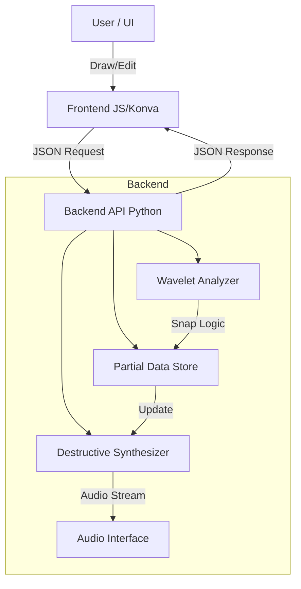
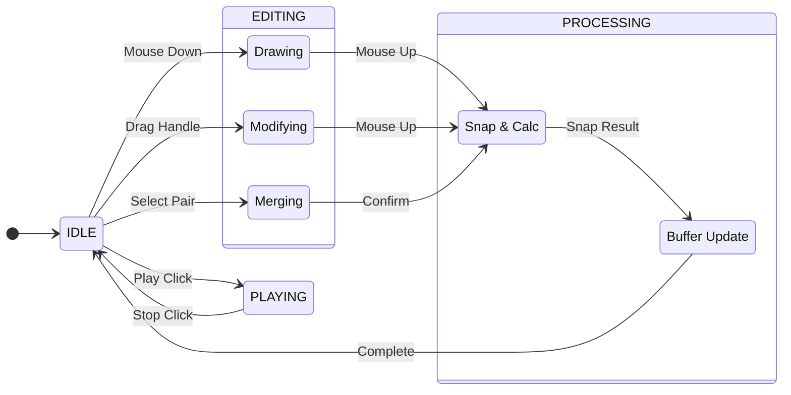

# SOMA技術設計

## 1. プロジェクト概要

### 1.1 目的

環境音やノイズ、楽器音、声などのスペクトログラムを可視化し、ユーザーが指定した成分（パーシャル）を「音楽的なノート」として抽出するスタンドアロンアプリケーション。抽出結果は MPE (MIDI Polyphonic Expression) および CV (Control Voltage) として出力し、シンセサイザー等での再構築を可能にする。

---

## 2. システムアーキテクチャ

### 2.1 技術スタック

- **Runtime / GUI Wrapper:** `Python 3.1x` + `pywebview`
    - OS標準のレンダリングエンジン (WebKit/WebView2) を使用し、軽量化と配布容易性を確保。
- **Frontend (View/Controller):**
    - `HTML5 / CSS3 / TypeScript`
    - `Konva.js`: スペクトログラム画像とベクター描画（パーシャル）の高速レンダリング（Canvas APIラッパー）。
    - `React`
    - `Tailwind CSS`
- **Backend (Model):**
    - `NumPy`: 行列演算、バッファ管理。
    - `SciPy` / `PyWavelets`: 信号処理、CWT、補間。
    - `SoundDevice`: オーディオ再生。
- **Build / CI:**
    - `uv`: パッケージ・依存関係管理。
    - `PyInstaller`: 単体実行ファイル化。
    - `GitHub Actions (Self-hosted)`: ビルドパイプライン。

### 2.2 アーキテクチャ図 (Conceptual)

Frontend (JS) と Backend (Python) は `window.pywebview.api` を介して通信する。

コード スニペット



---

## 3. モジュール詳細設計

### 3.1 Backend: 解析エンジン (`Analyzer`)

FFTではなく **Continuous Wavelet Transform (CWT)** を採用する。

- **アルゴリズム:** Complex Morlet Wavelet を使用。
- **理由:** 低域の周波数解像度と高域の時間解像度（過渡特性の捕捉）を両立させるため。また、対数周波数軸との親和性が高い。
- **スナップ処理 (Peak Snapping):**
    - 各フレームの局所最大binリストを事前計算
    - ペン位置binから最近傍の局所最大へスナップ

### 3.2 Backend: 合成・再生エンジン (`Synthesizer`)

1万本以上のパーシャルをレイテンシなしで再生するため、**「破壊的加算 (Destructive Accumulation)」** 方式を採用する。

- **Master Buffer:**
    - `numpy.ndarray` (dtype=`float64`)
    - 長さ: プロジェクトの全尺分（例: 60秒 @ 44.1kHz ≈ 21MB）。
    - *※メモリ容量と精度のバランスを考慮し、64bit floatを採用。*
- **Add / Update Logic:**
    1. パーシャル追加時: サイン波を生成し、Master Buffer に加算 (`+=`)。
    2. パーシャル削除/編集時: 編集前のパラメータでサイン波を再生成し、Master Buffer から減算 (`=`)。
- **Playback:**
    - 再生ボタン押下時、Master Buffer を `float32` にキャストして `SoundDevice` に流すのみ。計算負荷はパーシャル数に依存しない。

### 3.3 Data Structure (`Partial`)

パーシャル1本を表すデータモデル。

```python
@dataclass
class PartialPoint:
    time: float       # 秒
    freq: float       # Hz
    amp: float        # 0.0 - 1.0 (Linear amplitude from Wavelet coeff)
    phase: float      # rad (Option: 再合成時の位相整合用)

@dataclass
class Partial:
    id: str           # UUID
    points: List[PartialPoint]
    is_muted: bool    # 計算対象外フラグ
    # ※ Gain, Pan などの人工的なパラメータは持たない
```

### 3.4 Wavelet解析・計算戦略 (Computation Strategy)

1分以上のオーディオデータを扱う際のメモリ爆発を防ぐため、**「表示用」と「解析用」でデータを分離する二層アーキテクチャ**を採用する。

1. **Visualization Layer (表示用・低解像度)**
    - **目的:** スペクトログラムの全体描画。
    - **手法:** `hop_length` を大きく設定（例: 512 samples ≈ 11ms）して間引き計算を行う。
    - **データサイズ:** 1分のオーディオで約 20MB 程度。
    - **タイミング:** プロジェクトロード時に一括計算し、RAMに保持する。ディスクキャッシュは不要。
2. **Interaction Layer (編集用・高解像度)**
    - **目的:** 描画時のピークスナップ、詳細解析。
    - **手法:** **On-the-fly (JIT) Computation**。全データをメモリに持たず、カーソル周辺の微小時間（例: $\pm 100\text{ms}$）のみを、ユーザー操作が発生した瞬間に局所的に計算する。
    - **データサイズ:** 数 KB 程度（一瞬で破棄）。
    - **タイミング:** マウスダウン / ドラッグ時のみ。
3. **Persistence (永続化)**
    - 巨大なCWT行列データは `.soma` ファイルに保存しない。
    - 「ソース音声パス」と「解析パラメータ」のみを保存し、次回起動時に Visualization Layer を再計算する。

### 3.5 データの永続化とファイル形式 (Data Persistence & File Format)

- **フォーマット:** JSON形式（拡張子 `.soma`）。
- **設計方針:** "Lightweight Recipe" (軽量なレシピ)。
    - ソース音声へのパスと解析パラメータ、抽出済みのパーシャルデータのみを記録する。
    - **巨大なWavelet解析結果（行列）は保存しない。** ロード時に再計算する。
- **データ構造概略:**
    - `meta`: バージョン情報
    - `source`: ファイルパス、ハッシュ
    - `analysis_settings`: 再現用パラメータ
    - `data.partials`: `[t, f, amp, phase]` の配列リスト

```json
{
  "meta": {
    "format_version": "1.0.0",
    "app_name": "SOMA",
    "created_at": "2023-10-27T10:00:00Z"
  },
  
  "source": {
    "file_path": "./rain.wav",
    "sample_rate": 44100,
    "duration_sec": 60.0,
    "md5_hash": "..." // ファイル整合性チェック用
  },

  "analysis_settings": {
    "freq_min": 20.0,
    "freq_max": 20000.0,
    "bins_per_octave": 48,
    "time_resolution_ms": 10.0
  },

  "data": {
    "partials": [
      {
        "id": "uuid-v4-string",
        "is_muted": false,
        // [Time(s), Freq(Hz), Amp(0.0-1.0), Phase(rad)]
        // シンプルな数値配列の羅列
        "points": [
          [1.00, 440.0, 0.5, 0.0],
          [1.01, 440.1, 0.5, 0.1],
          [1.02, 440.2, 0.6, 0.2]
        ]
      },
      // ... 繰り返し
    ]
  }
}
```

---

## 4. 機能仕様とロジック

### 4.1 描画・編集 (Editing Logic)

「移動」や「ゲイン調整」は排除し、解析結果の抽出に特化する。

1. **新規描画 (Draw):**
    - Command Name: `trace_partial`
    - ペンシルツールの軌跡をサンプリングし、Backend へ送信。スナップ処理を経て確定。
2. **延長 (Extend):**
    - Command Name: `extend_partial`
    - 端点をドラッグ。
    - ドラッグした際のユーザーのマウス操作の軌跡をもとにスナップ処理してリッジを partial に追加。
3. **部分消去 (Erase):**
    - Command Name: `apply_eraser`
    - **Frontend:** ユーザーが消しゴムツールでなぞった軌跡（座標リストと許容幅）を `MouseUp` 時に Backend へ送信する。
        
        ```json
        {
          "command": "apply_eraser",
          "payload": {
            // 物理量に変換された消しゴムのサイズ (半分サイズ = 半径相当)
            "tolerance_time_sec": 0.1,    // 時間方向の許容幅 (±0.1秒)
            "tolerance_freq_oct": 0.2,    // 周波数方向の許容幅 (±0.2オクターブ)
        
            // なぞった軌跡のリスト
            // [秒, Hz]
            "path": [
              [1.20, 440.0],
              [1.25, 442.0],
              ...
            ]
          }
        }
        ```
        
        "tolerance_time_sec": 0.1,    // 時間方向の許容幅 (±0.1秒)
        "tolerance_freq_oct": 0.2,    // 周波数方向の許容幅 (±0.2オクターブ)
        
    - **Backend:**
        1. 全パーシャルに対して当たり判定を行う。
        2. 衝突した区間のポイントを削除する。
        3. **再セグメンテーション:** 削除によって不連続（ギャップ）が生じた場合、元のパーシャルを複数の新しいパーシャル（新規UUID付与）に分割する。
        4. 更新されたパーシャルリスト全体を返す。
4. **結合 (Merge):**
    - Command Name: `merge_partials`
    - 離れた2つのパーシャルを選択。
    - **ロジック:** 2点間を直線で結ぶガイドを引き、そのガイド周辺で**再スナップ処理**を行う（単なる直線補間ではない）。これにより、途切れた区間の音成分も正確に拾う。

### 4.2 エクスポート (Export Logic)

### MPE (MIDI Polyphonic Expression)

- **Channel Management:**
    - MPE Zone あたり Ch 2-16 (計15ボイス)。
    - パーシャル数が15を超える場合、**SMF (Standard MIDI File) を分割して出力**する（例: `output_01.mid`, `output_02.mid`...）。
- **Pitch Bend:**
    - Sensitivity: ±48 semitones (Configurable).
    - 各時刻の $f(t)$ を基準ノート（Note On時のNote Number）からの偏差として出力。
    - 偏差がレンジを超過した場合、Note Off/On (Retrigger) を挿入。
- **Amplitude Mapping:**
    - 設定により `Velocity` (Note Onのみ), `Channel Pressure`, `CC74` へマッピング。
    - 変換式: Linear Amplitude -> dB Scale -> MIDI Value (0-127)。

### Audio / CV Output

- **Format:** 1 channel WAV (32bit float) 複数ファイル.
- なるべく voice 数が少なくなるように、パーシャルをボイスに分けてから書き出し。
- 同時に鳴るパーシャルの最大数がボイス数
- 1 voice は 2 ファイル
    - L: Pitch CV (1V/Oct, 0V=C3基準).
    - R: Gate/Amp CV (Linear envelope, DC Coupled).

---

## 5. UI/UX 設計

### 5.1 画面レイアウト

- **Canvas座標系:**
    - Backend (Hz/Sec) と Frontend (Pixel) の変換は Frontend 側で責務を持つ。
    - Backend は常に物理量 (Hz/Sec) のみを扱う。
- **レイヤー構成 (Konva.js):**
    - Layer 0 (Background): スペクトログラム画像。
    - Layer 1 (Static): 確定済みパーシャル（負荷軽減のためキャッシュ化）。
    - Layer 2 (Dynamic): 描画中の軌跡、選択中のハイライト。

詳細は [docs/ui.md](ui.md) を参照。

### 5.2 状態遷移 (State Machine)

非同期処理によるデータの不整合を防ぐ。

コード スニペット



---

## 6. インフラ・開発環境

### 6.1 依存管理・ビルド

- **Dependency Manager:** `uv`
    - `pyproject.toml` にてバージョンを厳密固定。
- **Packager:** `PyInstaller`
    - NumPy/SciPy の隠蔽された DLL/Dylib 依存関係を Hooks で解決。
    - `pywebview` のブラウザエンジン依存を解決。

### 6.2 CI/CD (GitHub Actions)

- **Runner:** **Self-hosted Runner** (macOS / Windows)
    - クラウドランナーの高コスト回避と、クリーンなビルド環境の維持（毎回 `uv sync --clean` を実行）。
- **Workflow:**
    1. Test (Unit Tests for DSP logic).
    2. Build Frontend (`npm run build`).
    3. Build Backend (`pyinstaller`).
    4. Artifact Upload.

---

## 7. リスクと対策

| **リスク項目** | **対策** |
| --- | --- |
| **メモリ消費** | 破壊的加算方式により、1万パーシャルでもバッファは1本分(20MB強)に抑制。描画パスデータは軽量なため問題なし。 |
| **計算誤差** | `float32` での多数回の加減算によるノイズ蓄積を防ぐため、Master Buffer は `float64` で保持する。 |
| **配布後の起動エラー** | `uv` による厳密なロックと、CI上でのクリーンビルド生成物のみを配布することで、DLL欠損等の環境依存エラーを防ぐ。 |
| **GUI描画負荷** | `Konva.js` を使用し、大量のオブジェクトを描画する際は Canvas のキャッシュ機能を活用する。 |